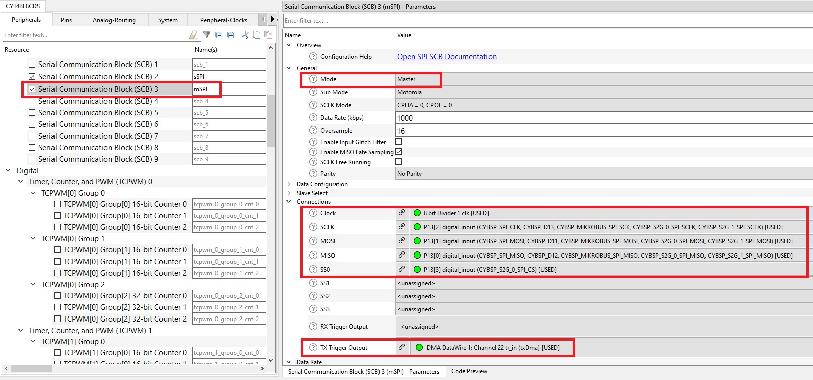
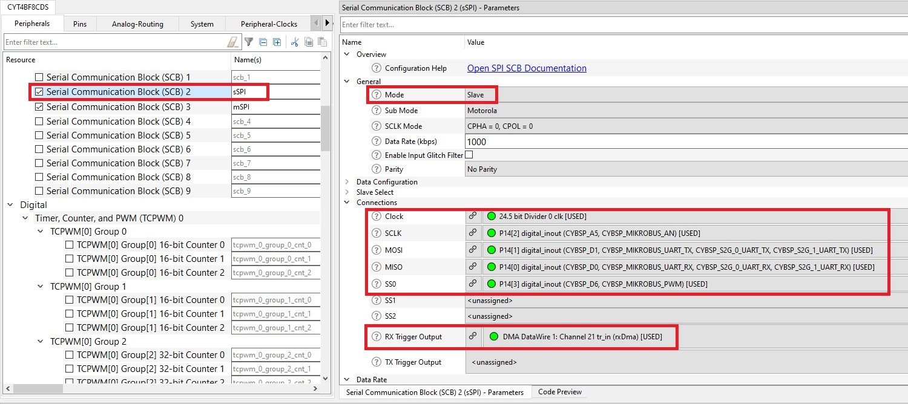
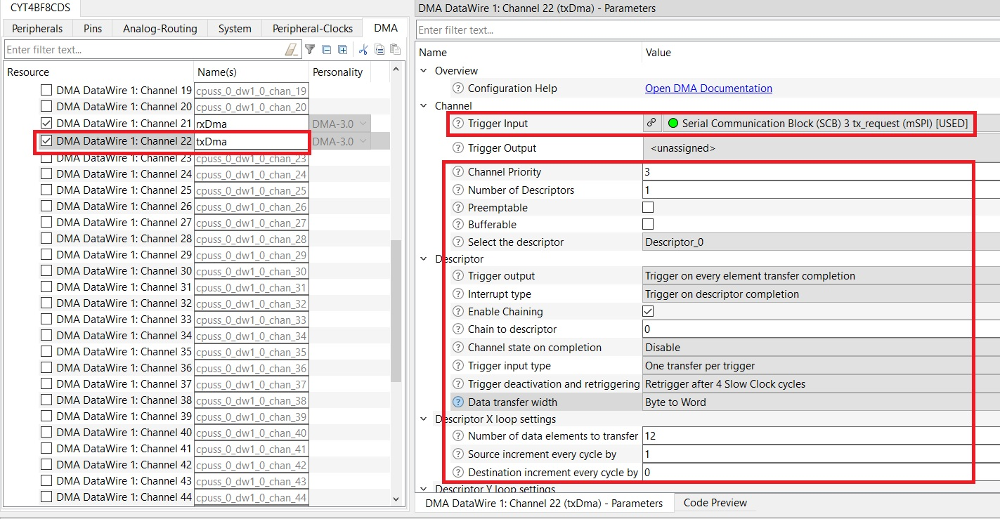
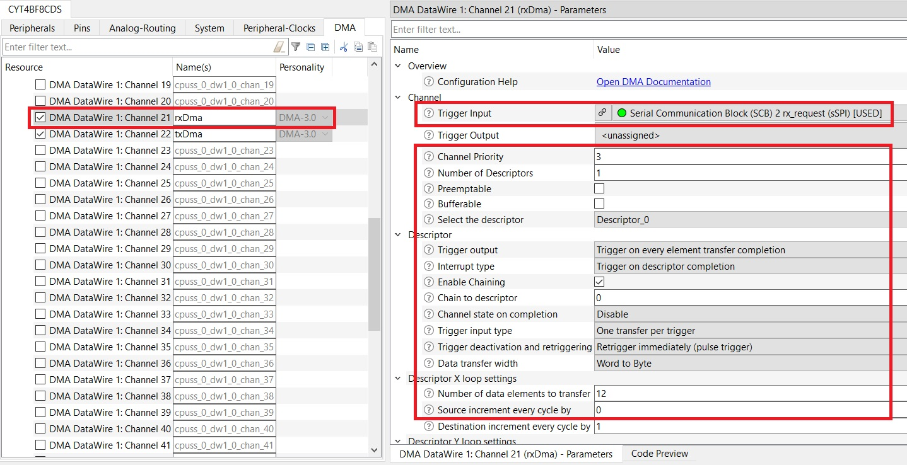

# TRAVEO™ T2G: SCB SPI master with DMA

This example demonstrates the use of the SPI serial communication block (SCB) resource for Infineon MCU in master and slave mode using DMA. The SPI master is configured to send command packets to control a user LED on the slave. Both the master and slave can be on the same device or on different devices.

[View this README on GitHub.](https://github.com/Infineon/mtb-t2g-lite-example-spi-master-dma)

## Requirements

- [ModusToolbox&trade; software](https://www.infineon.com/modustoolbox) v3.0 or later (tested with v3.0)
- Programming language: C
- Associated parts: [TRAVEO™ T2G body high MCU](https://www.infineon.com/cms/en/product/microcontroller/32-bit-traveo-t2g-arm-cortex-microcontroller/32-bit-traveo-t2g-arm-cortex-for-body/traveo-t2g-cyt4bf-series/)


## Supported toolchains (make variable 'TOOLCHAIN')

- GNU Arm&reg; embedded compiler v10.3.1 (`GCC_ARM`) - Default value of `TOOLCHAIN`
- Arm&reg; compiler v6.16 (`ARM`)
- IAR C/C++ compiler v9.30.1 (`IAR`)


## Supported kits (make variable 'TARGET')

- TRAVEO™ T2G body high evaluation kit (`KIT_T2G-B-H_LITE`) - Default value of `TARGET`


## Hardware setup

This example uses the board's default configuration. See the kit user guide to ensure that the board is configured correctly.

Use jumper wires to establish a connection between the master and slave on the kit. For the default kit, do the following on the board (verify with the corresponding custom *design.modus* file to find the respective SPI pins for other kits).

TRAVEO™ T2G body high evaluation kit:
1. Connect P13[0] to P14[0].
2. Connect P13[1] to P14[1].
3. Connect P13[2] to P14[2].
4. Connect P13[3] to P14[3].

## Software setup

This example requires no additional software or tools.


## Using the code example

Create the project and open it using one of the following:

<details><summary><b>In Eclipse IDE for ModusToolbox&trade; software</b></summary>

1. Click the **New Application** link in the **Quick Panel** (or, use **File** > **New** > **ModusToolbox&trade; Application**). This launches the [Project Creator](https://www.infineon.com/ModusToolboxProjectCreator) tool.

2. Pick a kit supported by the code example from the list shown in the **Project Creator - Choose Board Support Package (BSP)** dialog.

   When you select a supported kit, the example is reconfigured automatically to work with the kit. To work with a different supported kit later, use the [Library Manager](https://www.infineon.com/ModusToolboxLibraryManager) to choose the BSP for the supported kit. You can use the Library Manager to select or update the BSP and firmware libraries used in this application. To access the Library Manager, click the link from the **Quick Panel**.

   You can also just start the application creation process again and select a different kit.

   If you want to use the application for a kit not listed here, you may need to update the source files. If the kit does not have the required resources, the application may not work.

3. In the **Project Creator - Select Application** dialog, choose the example by enabling the checkbox.

4. (Optional) Change the suggested **New Application Name**.

5. The **Application(s) Root Path** defaults to the Eclipse workspace which is usually the desired location for the application. If you want to store the application in a different location, you can change the *Application(s) Root Path* value. Applications that share libraries should be in the same root path.

6. Click **Create** to complete the application creation process.

For more details, see the [Eclipse IDE for ModusToolbox&trade; software user guide](https://www.infineon.com/MTBEclipseIDEUserGuide) (locally available at *{ModusToolbox&trade; software install directory}/docs_{version}/mt_ide_user_guide.pdf*).

</details>

<details><summary><b>In command-line interface (CLI)</b></summary>

ModusToolbox&trade; software provides the Project Creator as both a GUI tool and the command line tool, "project-creator-cli". The CLI tool can be used to create applications from a CLI terminal or from within batch files or shell scripts. This tool is available in the *{ModusToolbox&trade; software install directory}/tools_{version}/project-creator/* directory.

Use a CLI terminal to invoke the "project-creator-cli" tool. On Windows, use the command line "modus-shell" program provided in the ModusToolbox&trade; software installation instead of a standard Windows command-line application. This shell provides access to all ModusToolbox&trade; software tools. You can access it by typing `modus-shell` in the search box in the Windows menu. In Linux and macOS, you can use any terminal application.

The "project-creator-cli" tool has the following arguments:

Argument | Description | Required/optional
---------|-------------|-----------
`--board-id` | Defined in the `<id>` field of the [BSP](https://github.com/Infineon?q=bsp-manifest&type=&language=&sort=) manifest | Required
`--app-id`   | Defined in the `<id>` field of the [CE](https://github.com/Infineon?q=ce-manifest&type=&language=&sort=) manifest | Required
`--target-dir`| Specify the directory in which the application is to be created if you prefer not to use the default current working directory | Optional
`--user-app-name`| Specify the name of the application if you prefer to have a name other than the example's default name | Optional

<br />

The following example will clone the "[mtb-t2g-lite-example-spi-master-dma](https://github.com/Infineon/mtb-t2g-lite-example-spi-master-dma)" application with the desired name "PdlScbMasterDma" configured for the *KIT_T2G-B-H_LITE* BSP into the specified working directory, *C:/mtb_projects*:

   ```
   project-creator-cli --board-id KIT_T2G-B-H_LITE --app-id mtb-t2g-lite-example-spi-master-dma --user-app-name PdlScbMasterDma --target-dir "C:/mtb_projects"
   ```

**Note:** The project-creator-cli tool uses the `git clone` and `make getlibs` commands to fetch the repository and import the required libraries. For details, see the "Project creator tools" section of the [ModusToolbox&trade; software user guide](https://www.infineon.com/ModusToolboxUserGuide) (locally available at *{ModusToolbox&trade; software install directory}/docs_{version}/mtb_user_guide.pdf*).

To work with a different supported kit later, use the [Library Manager](https://www.infineon.com/ModusToolboxLibraryManager) to choose the BSP for the supported kit. You can invoke the Library Manager GUI tool from the terminal using `make modlibs` command or use the Library Manager CLI tool "library-manager-cli" to change the BSP.

The "library-manager-cli" tool has the following arguments:

Argument | Description | Required/optional
---------|-------------|-----------
`--add-bsp-name` | Name of the BSP that should be added to the application | Required
`--set-active-bsp` | Name of the BSP that should be as active BSP for the application | Required
`--add-bsp-version`| Specify the version of the BSP that should be added to the application if you do not wish to use the latest from manifest | Optional
`--add-bsp-location`| Specify the location of the BSP (local/shared) if you prefer to add the BSP in a shared path | Optional

</details>

<details><summary><b>In third-party IDEs</b></summary>

Use one of the following options:

- **Use the standalone [Project Creator](https://www.infineon.com/ModusToolboxProjectCreator) tool:**

   1. Launch Project Creator from the Windows Start menu or from *{ModusToolbox&trade; software install directory}/tools_{version}/project-creator/project-creator.exe*.

   2. In the initial **Choose Board Support Package** screen, select the BSP, and click **Next**.

   3. In the **Select Application** screen, select the appropriate IDE from the **Target IDE** drop-down menu.

   4. Click **Create** and follow the instructions printed in the bottom pane to import or open the exported project in the respective IDE.

<br />

- **Use command-line interface (CLI):**

   1. Follow the instructions from the **In command-line interface (CLI)** section to create the application, and then import the libraries using the `make getlibs` command.

   2. Export the application to a supported IDE using the `make <ide>` command.

   3. Follow the instructions displayed in the terminal to create or import the application as an IDE project.

For a list of supported IDEs and more details, see the "Exporting to IDEs" section of the [ModusToolbox&trade; software user guide](https://www.infineon.com/ModusToolboxUserGuide) (locally available at *{ModusToolbox&trade; software install directory}/docs_{version}/mtb_user_guide.pdf*).

</details>


## Operation

You can configure this example to work in master-only, slave-only, or both master and slave SPI modes by configuring the value of the `SPI_MODE` macro in the *interface.h* file. By default, this example is configured to work in master SPI mode. Kits with two SPI ports can be configured to work in both SPI modes: one acting as the master and the other as the slave.

1. Connect the board to your PC using the provided USB cable through the KitProg3 USB connector.

2. Configure the value of the `SPI_MODE` macro in *interface.h* to `SPI_MODE_BOTH` (only for kits with two SPI ports).

3. Program the board using one of the following:

   <details><summary><b>Using Eclipse IDE for ModusToolbox&trade; software</b></summary>

      1. Select the application project in the Project Explorer.

      2. In the **Quick Panel**, scroll down, and click **\<Application Name> Program (KitProg3_MiniProg4)**.
   </details>

   <details><summary><b>Using CLI</b></summary>

     From the terminal, execute the `make program` command to build and program the application using the default toolchain to the default target. The default toolchain and target are specified in the application's Makefile but you can override those values manually:
      ```
      make program TARGET=<BSP> TOOLCHAIN=<toolchain>
      ```

      Example:
      ```
      make program TARGET=KIT_T2G-B-H_LITE TOOLCHAIN=GCC_ARM
      ```
   </details>

4. After programming, the application starts automatically. Observe that the kit LED blinks at 1 Hz.


## Configuring a kit with two SPI ports in both master and slave mode

By default, the kit is configured to work in both-master-and-slave mode (ensure that the `SPI_MODE` macro in *interface.h* is configured as `SPI_MODE_BOTH`).

Do the following to configure the kit to work in both-master-and-slave mode:

1. Run the [Device configurator](https://www.infineon.com/ModusToolboxDeviceConfig) tool from the Quick Panel of the IDE.

   Because the kit has only one available SPI port, by default, the associated SCB is aliased as *mSPI* in the **Peripherals** tab.

2. Rename the associated SCBs to **sSPI and mSPI** and configure the SCBs:

   **Figure 1. Configure peripherals master SPI**

   
   
   **Figure 2. Configure peripherals slave SPI**

   


3. In the **Pins** tab, assign the correct drive mode to SPI pins in the **Drive Mode** drop-down menu:

   **Table 1. Drive mode for Slave SPI pins**

    SPI pins | Drive mode
    :--------| ------------
    MOSI     | Digital High-Z. Input buffer ON
    MISO     | Strong Drive. Input buffer OFF
    SCLK     | Digital High-Z. Input buffer ON
    SS0      | Digital High-Z. Input buffer ON
	
	**Table 2. Drive mode for Master SPI pins**
    SPI pins | Drive mode
    :--------| ------------
    MOSI     | Strong Drive. Input buffer OFF
    MISO     | Digital High-Z. Input buffer ON
    SCLK     | Strong Drive. Input buffer OFF
    SS0      | Strong Drive. Input buffer OFF

4. In the **DMA** tab, rename the DMA to **txDma and rxDma** and configure it:

   **Figure 3. Configure txDMA**

   
   
   **Figure 4. Configure rxDMA**

   

5. Select **File** > **Save** to save the changes and generate the configuration files.


## Debugging

You can debug the example to step through the code. In the IDE, use the **\<Application Name> Debug (KitProg3_MiniProg4)** configuration in the **Quick Panel**. For details, see the "Program and debug" section in the [Eclipse IDE for ModusToolbox&trade; software user guide](https://www.infineon.com/MTBEclipseIDEUserGuide).

**Note:** **(Only while debugging)** On the debugging CPU, some code in `main()` may execute before the debugger halts at the beginning of `main()`. This means that some code executes twice – once before the debugger stops execution, and again after the debugger resets the program counter to the beginning of `main()`. See [KBA231071](https://community.infineon.com/docs/DOC-21143) to learn about this and for the workaround.


## Design and implementation

### Resources and settings

The Arm&reg; Cortex&reg;-M7 (CM7) CPU controls both the master and slave SCBs. You can configure this example to operate in both master and slave SPI modes so that you can run this example using a single kit provided that the kit supports two SPI ports on its I/O header.

The master sends a packet to the slave with the command to turn ON or turn OFF the user LED. The packets are sent at an interval of 1 second. DMA is used to transfer the command data from the SRAM to the SPI FIFO at the master side, and similarly from the SPI FIFO to the SRAM at the slave side. The slave receives the packet and controls the LED according to the command.

**Table 3. Application resources**

 Resource            | Alias/object        | Purpose
 --------------------| --------------------| ----------------------------------
 SCB (SPI)           |      mSPI           | Master SPI SCB
 SCB (SPI)           |      sSPI           | Slave SPI SCB
 GPIO                |     CYBSP_USER_LED  | LED indication
 DMA                 |     txDma           | Data Transfer
 DMA                 |     rxDma           | Data Transfer

## Related resources

Resources | Links
-----------|------------------
Application notes | AN235305 - GETTING STARTED WITH TRAVEO™ T2G FAMILY MCUS IN MODUSTOOLBOX™
Training  | [Traveo™ II Serial Communication Block (SCB)](https://www.infineon.com/dgdl/Infineon-Traveo_II_Serial_Communication_Block_(SCB)-Training-v05_00-EN.pdf?fileId=8ac78c8c7d718a49017d9f6cf3cc3b29) <br> [TRAVEO™ T2G Direct Memory Access (DMA)](https://www.infineon.com/dgdl/Infineon-Traveo_II_Direct_Memory_Access_(DMA)-Training-v07_00-EN.pdf?fileId=8ac78c8c7d718a49017d9f6c75883ae9)
Code examples  | [TRAVEO™ T2G MCU examples](https://github.com/orgs/Infineon/repositories?q=mtb-t2g-&type=all&language=&sort=) on GitHub
Device documentation | [Device datasheet](https://www.cypress.com/documentation/datasheets/cyt4bf-datasheet-32-bit-arm-cortex-m7-microcontroller-traveo-ii-family) <br> [Architecture Technical reference manuals (TRM)](https://www.cypress.com/documentation/technical-reference-manuals/traveo-ii-automotive-body-controller-high-family) <br> [Registers TRM](https://www.cypress.com/documentation/technical-reference-manuals/traveo-t2g-tvii-b-h-8m-registers-body-controller-high)
Libraries on GitHub | [mtb-pdl-cat1](https://github.com/Infineon/mtb-pdl-cat1) – Peripheral driver library (PDL) <br> [mtb-hal-cat1](https://github.com/Infineon/mtb-hal-cat1) – Hardware abstraction layer (HAL) library
Middleware on GitHub  | [mcu-middleware](https://github.com/Infineon/modustoolbox-software) – Links to all MCU middleware
Tools  | [Eclipse IDE for ModusToolbox&trade; software](https://www.infineon.com/modustoolbox) – ModusToolbox&trade; software is a collection of easy-to-use software and tools enabling rapid development with Infineon MCUs, covering applications from embedded sense and control to wireless and cloud-connected systems using AIROC&trade; Wi-Fi and Bluetooth® connectivity devices.

<br />

## Other resources

Infineon provides a wealth of data at www.infineon.com to help you select the right device, and quickly and effectively integrate it into your design.

For TRAVEO™ T2G body high MCU devices, see [TRAVEO™ T2G CYT4BF Series](https://www.infineon.com/cms/en/product/microcontroller/32-bit-traveo-t2g-arm-cortex-microcontroller/32-bit-traveo-t2g-arm-cortex-for-body/traveo-t2g-cyt4bf-series/).

## Document history

 Version | Description of change
 ------- | ---------------------
 1.0.0   | New code example
<br />

---------------------------------------------------------

© Cypress Semiconductor Corporation, 2022. This document is the property of Cypress Semiconductor Corporation, an Infineon Technologies company, and its affiliates ("Cypress").  This document, including any software or firmware included or referenced in this document ("Software"), is owned by Cypress under the intellectual property laws and treaties of the United States and other countries worldwide.  Cypress reserves all rights under such laws and treaties and does not, except as specifically stated in this paragraph, grant any license under its patents, copyrights, trademarks, or other intellectual property rights.  If the Software is not accompanied by a license agreement and you do not otherwise have a written agreement with Cypress governing the use of the Software, then Cypress hereby grants you a personal, non-exclusive, nontransferable license (without the right to sublicense) (1) under its copyright rights in the Software (a) for Software provided in source code form, to modify and reproduce the Software solely for use with Cypress hardware products, only internally within your organization, and (b) to distribute the Software in binary code form externally to end users (either directly or indirectly through resellers and distributors), solely for use on Cypress hardware product units, and (2) under those claims of Cypress’s patents that are infringed by the Software (as provided by Cypress, unmodified) to make, use, distribute, and import the Software solely for use with Cypress hardware products.  Any other use, reproduction, modification, translation, or compilation of the Software is prohibited.
<br />
TO THE EXTENT PERMITTED BY APPLICABLE LAW, CYPRESS MAKES NO WARRANTY OF ANY KIND, EXPRESS OR IMPLIED, WITH REGARD TO THIS DOCUMENT OR ANY SOFTWARE OR ACCOMPANYING HARDWARE, INCLUDING, BUT NOT LIMITED TO, THE IMPLIED WARRANTIES OF MERCHANTABILITY AND FITNESS FOR A PARTICULAR PURPOSE.  No computing device can be absolutely secure.  Therefore, despite security measures implemented in Cypress hardware or software products, Cypress shall have no liability arising out of any security breach, such as unauthorized access to or use of a Cypress product. CYPRESS DOES NOT REPRESENT, WARRANT, OR GUARANTEE THAT CYPRESS PRODUCTS, OR SYSTEMS CREATED USING CYPRESS PRODUCTS, WILL BE FREE FROM CORRUPTION, ATTACK, VIRUSES, INTERFERENCE, HACKING, DATA LOSS OR THEFT, OR OTHER SECURITY INTRUSION (collectively, "Security Breach").  Cypress disclaims any liability relating to any Security Breach, and you shall and hereby do release Cypress from any claim, damage, or other liability arising from any Security Breach.  In addition, the products described in these materials may contain design defects or errors known as errata which may cause the product to deviate from published specifications. To the extent permitted by applicable law, Cypress reserves the right to make changes to this document without further notice. Cypress does not assume any liability arising out of the application or use of any product or circuit described in this document. Any information provided in this document, including any sample design information or programming code, is provided only for reference purposes.  It is the responsibility of the user of this document to properly design, program, and test the functionality and safety of any application made of this information and any resulting product.  "High-Risk Device" means any device or system whose failure could cause personal injury, death, or property damage.  Examples of High-Risk Devices are weapons, nuclear installations, surgical implants, and other medical devices.  "Critical Component" means any component of a High-Risk Device whose failure to perform can be reasonably expected to cause, directly or indirectly, the failure of the High-Risk Device, or to affect its safety or effectiveness.  Cypress is not liable, in whole or in part, and you shall and hereby do release Cypress from any claim, damage, or other liability arising from any use of a Cypress product as a Critical Component in a High-Risk Device. You shall indemnify and hold Cypress, including its affiliates, and its directors, officers, employees, agents, distributors, and assigns harmless from and against all claims, costs, damages, and expenses, arising out of any claim, including claims for product liability, personal injury or death, or property damage arising from any use of a Cypress product as a Critical Component in a High-Risk Device. Cypress products are not intended or authorized for use as a Critical Component in any High-Risk Device except to the limited extent that (i) Cypress’s published data sheet for the product explicitly states Cypress has qualified the product for use in a specific High-Risk Device, or (ii) Cypress has given you advance written authorization to use the product as a Critical Component in the specific High-Risk Device and you have signed a separate indemnification agreement.
<br />
Cypress, the Cypress logo, and combinations thereof, WICED, ModusToolbox, PSoC, CapSense, EZ-USB, F-RAM, and Traveo are trademarks or registered trademarks of Cypress or a subsidiary of Cypress in the United States or in other countries. For a more complete list of Cypress trademarks, visit cypress.com. Other names and brands may be claimed as property of their respective owners.
